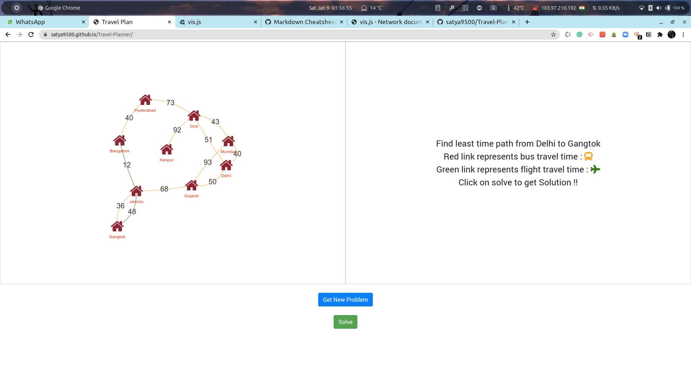
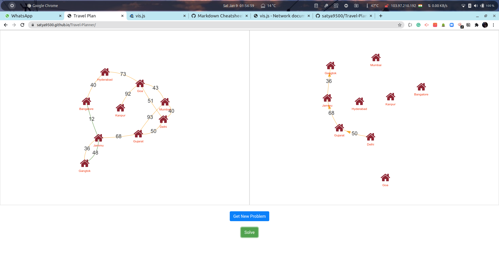

# Travel-Planner

This is a simple project implementing Visual representation of Djikstra algorithm. Random graphs are generated on each new problem and solved by Djikstra's Algorithm.
Optimized route is selected by choosing between flights and buses in the graph.
To construct graphs, I have used [vis.js](https://visjs.org/). Thanks to the community who built this library.

You can see the site live [here](https://satya9500.github.io/Travel-Planner/).

### Generate Random Problem
 

### Djikstra's Solution

